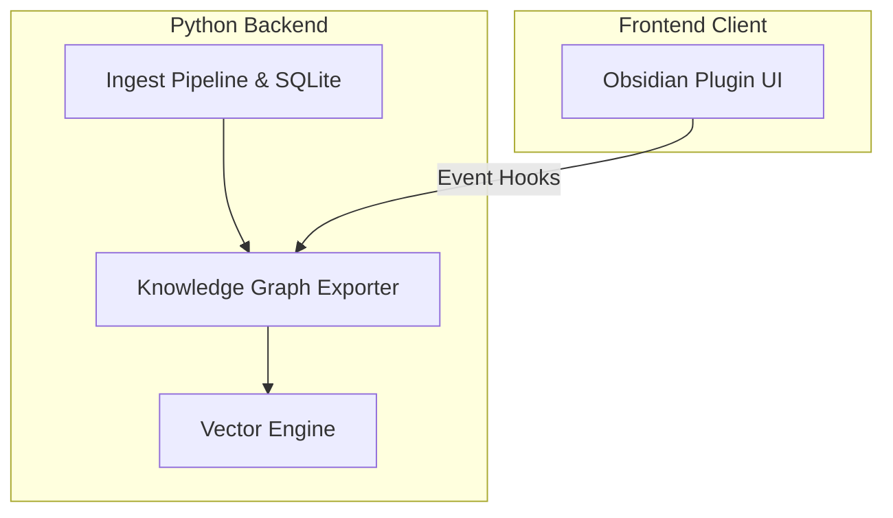

# sovraan 2.0.0

sovraan is a sovereign, local-first platform designed for cryptographic file deduplication, decentralized notary anchoring, and semantic vault indexing. Built on the strict principles of **Canonical Truth**, **Auditable Autonomy**, and **Zero-Drift Verification**, sovraan ensures that your digital assets remain mathematically verifiable and semantically linked without external reliance.

## Core Philosophy

*   **Canonical Truth**: Every file is uniquely and deterministically identified by its cryptographic SHA-256 content hash, establishing an immutable registry of data integrity.
*   **Auditable Autonomy**: The platform prioritizes offline-first operations. Scanning, indexing, graphing, and embedding run entirely on local computing infrastructure.
*   **Zero-Drift Verification**: Multi-layered validator gates perform byte-for-byte fidelity comparisons to prevent metadata drift, storage corruption, or index degradation.

---

## Ecosystem Architecture

sovraan utilizes a dual-stream architecture that marries a high-scale Python backend with a streamlined TypeScript frontend Obsidian plugin.



### 1. sovraan 2.0 Core (Python Backend)
*   **Ingest & State**: Relational state is persisted in `data_mine.db`. Concurrency-safe producer-consumer pipelines process raw storage volumes, hashing and logging files under a Write-Ahead Log (WAL) database policy.
*   **Knowledge Graph Exporter** ([knowledge_graph_exporter.py](file:///c:/Users/marks/dev/projects/sovraan/core/knowledge_graph_exporter.py)): Recursively crawls the vault to parse markdown frontmatter and body segments. Outputs a normalized `graph_manifest.json` representing vault nodes and semantic relationship edges using deterministic, path-normalized SHA-256 hash IDs.
*   **Sovereign Vector Engine** ([vector_engine.py](file:///c:/Users/marks/dev/projects/sovraan/core/vector_engine.py)): Ingests the normalized manifest, loads note bodies, embeds content using a local SentenceTransformers pipeline (`all-MiniLM-L6-v2`), and indexes data in a persistent local ChromaDB instance (`.chroma_index`).
*   **Integrity Gate** ([test_validator.py](file:///c:/Users/marks/dev/projects/sovraan/tests/test_validator.py)): Performs absolute binary content and cryptographic hash verification to ensure 100% data fidelity between the vector index and source files on disk.

### 2. Obsidian UI Plugin (TypeScript Frontend)
*   Located in the `obsidian-plugin/` directory, this plugin provides a clean interface for interacting with the vault index. It registers event hooks to automatically update the knowledge graph manifest when files are modified, and offers tools for viewing semantic relations.

---

## GitLab Integration & Version Control

All development activities, issue tracking, version control, and CI/CD automation pipelines for the sovraan ecosystem are hosted exclusively on **GitLab**. 

*   **CI Pipelines**: Automated runners compile Python executables, check lint compliance, and execute the test validation suite.
*   **Branching Workflow**: Feature development must target separate branches and merge into `main` via approved merge requests after passing the automated GitLab pipeline.

---

## Quickstart CLI Commands

### 1. Activating the Isolated Environment
Ensure Python dependencies are loaded inside the local virtual environment:
```powershell
# Windows PowerShell
.venv\Scripts\Activate.ps1
```

### 2. Launching the Orchestration UI
Run the graphical Calm Journey GUI interface:
```bash
python sovraan_core.py
```

### 3. Running Exporter & Vector Ingestion
Manually export and index your local vault:
```bash
# Export the Knowledge Graph
python core/knowledge_graph_exporter.py --vault /path/to/vault

# Ingest into Vector Store
python -c "from core.vector_engine import SovereignVectorEngine; SovereignVectorEngine('/path/to/vault').ingest_manifest()"
```

### 4. Running the Verification Suite
Run the test suites to audit graph, vector, and validator integrity:
```bash
python -m pytest tests/
```
